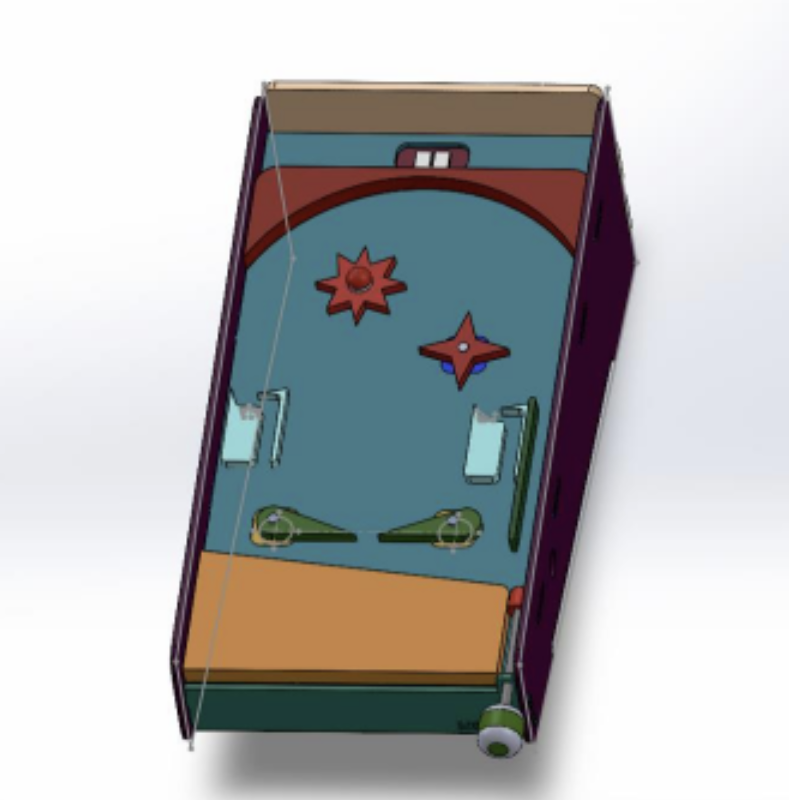
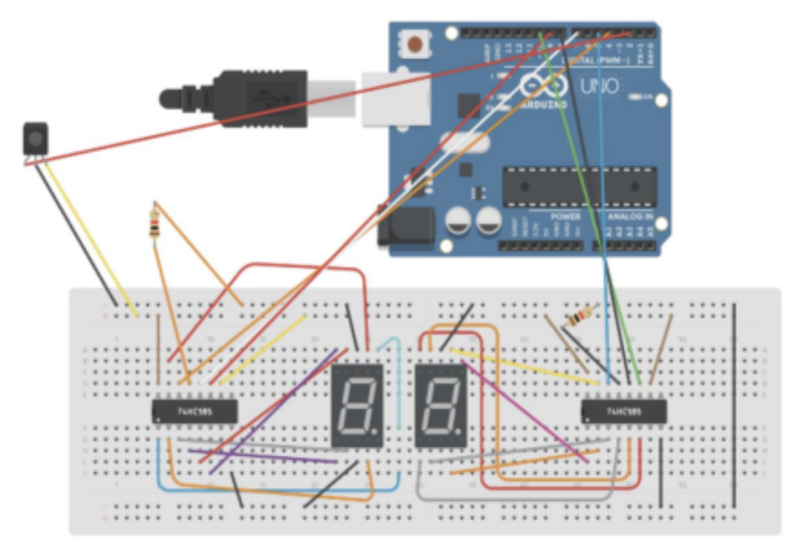
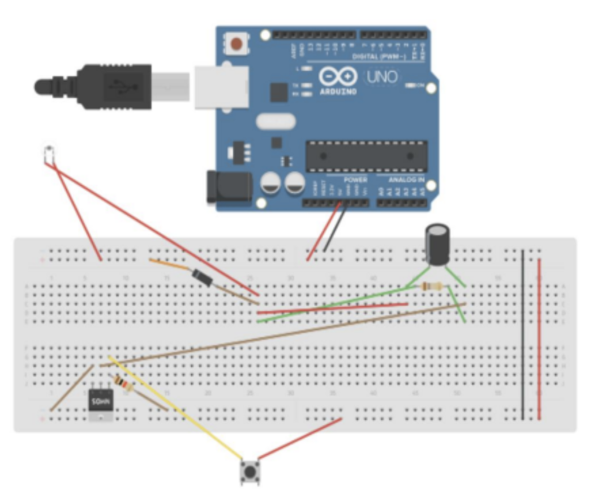
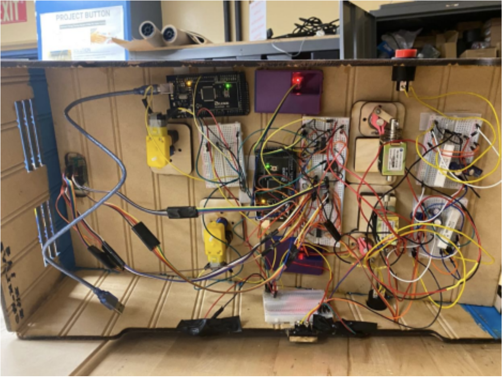
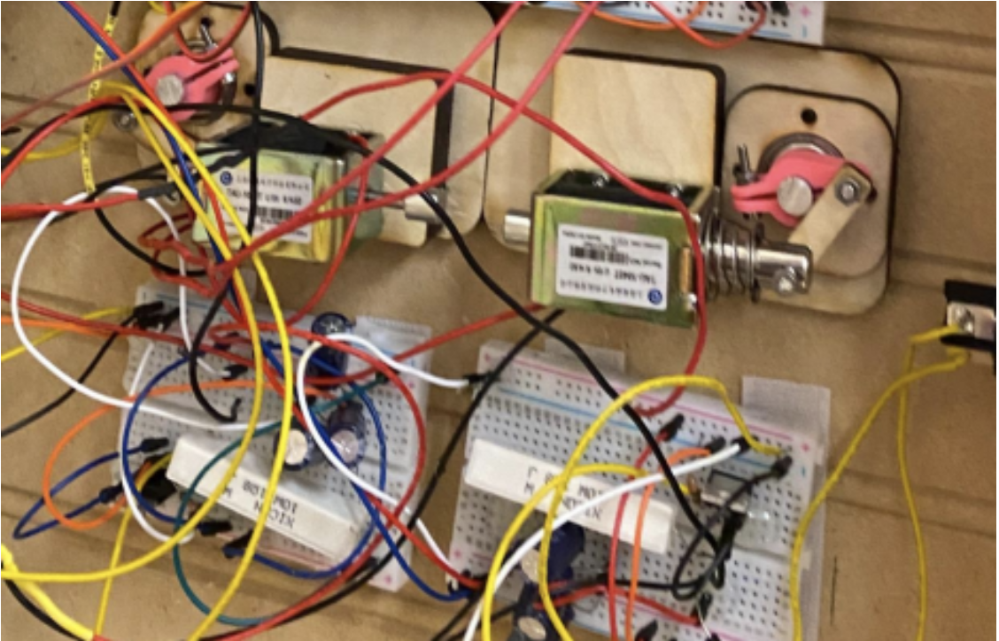
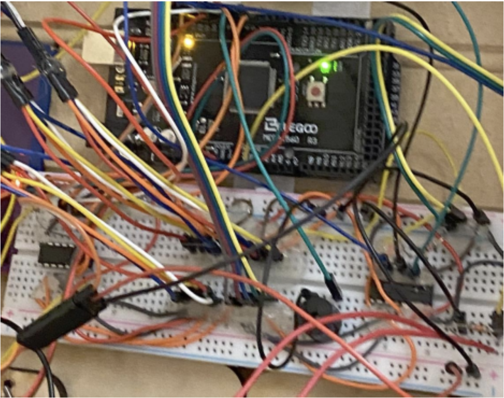

# DIY Pinball Machine

## OVERVIEW
Co-created an advanced pinball machine featuring custom 3D printed/laser-cut components, solenoid-operated flippers, IR sensor-based scoring, dual seven-segment score displays, motor-driven obstacles, a precision plunger, and a piezoelectric reset system.
Team Members:
1. Veeraj Vishnu
2. Nghi Lu
3. Christian Hendrick

## Demo
__Please click to watch demo:__

## Functionality Goals

1. Paddle propels ball across playfield.
2. Ball introduced via plunger.
3. Multiple scoring mechanisms (2 IR sensors).
4. Seven-segment display for score tracking.
5. Piezo detects round loss and resets score.
6. Start/stop button for system control.
7. Game resets on system start and round completion.
8. Ball gravitates towards paddles.
9. Visually appealing design.

10. Special Requirements:
...* Electronically activated paddle(s).
...* Auditory score feedback.
...* Ball-detecting actuators (flippers).
...* Optical sensors for two applications.
...* Integration of electric motors, solenoids, and RC servos.
...* Automated gating mechanism for ball handling between rounds.

## CAD Assembly and Circuit schematics
### Solidworks CAD Assembly:

### 7 segment circuit:

### IR sensor basic circuit:

## CIRCUIT INTEGRATION AND EXECUTION
### Overall Wiring Situation:

### Flipper Solenoid Circuit:

### IR and 7 Segment Display Circuit:

## Final Trace Matrix

| Spec. Number | Spec. Description                   |       Test to perform                   | Measured values |
|--------------|-------------------------------------|:---------------------------------------:|-----------------|
| 1            | Paddle propels ball across playfield | Test flipper strength and range         | The flippers work better than expected. The ball reaches the far end of the target |
| 2            | Ball introduced via plunger         | Test plunger functionality and force    | The plunger worked as expected |
| 3            | Multiple scoring mechanisms (2 IR sensors) | Test sensor accuracy and response time  | Current score and current factor increase as designed |
| 4            | Seven-segment display for score tracking | Test display functionality and accuracy | The score is going up as expected and the buzzer goes off every time. Also, when it reaches 99, the buzzer will go off all the way |
| 5            | Piezo detects round loss and resets score | Test piezo sensitivity and reset feature | Player will have to push the flat buzzer, which is covered by a black octopus, to reset the point to 0 (meaning you lost the game, play again) |
| 6            | Start/stop button for system control | Test button functionality and wiring     | We placed the on/off button on the side of the machine |
| 7            | Game resets on system start and round completion | Test game reset conditions and timing    | When the player presses the flat buzzer, the sensor gate will be opened, and the ball will enter the playfield again |
| 8            | Ball gravitates towards paddles     | Test ball movement and playfield design  | The pinball always moves towards the flippers |
