# SystemVerilog Bitcoin Implementation
## Project Description
In this project I implement the SHA256 Cryptographic algorithm in order to realize a bitcoin blockchain in SystemVerilog. This implementation can be used for a 20 word, 30 word or 40 word input. This report includes the descriptions of the algorithms used, along with the waveforms and transcripts attained from my testbench. 

The project was completed in two parts: 
1. Implementing the SHA256 cryptographic hash algorithm
2. Using the SHA256 module to implement a bitcoin hash blockchain

## PART 1: SHA256 
### SHA256 explained: 
SHA256 is a cryptographic secure hash algorithm used for bitcoin. This algorithm takes an input  message, and outputs a unique 256 bit hash.  Salient properties of sha256 include that the output is _preimage resistant, second preimage resistant_ and is also _collision resistant_. The same input produces the same output, with a one to one mapping. 

### SHA256 implementation:
My implementation uses **sequential logic** through only one always_ff block and FSM logic. The FSM states are as follows: IDLE, READ_BUFFER, READ_MSG, BLOCK, COMPUTE, WRITE_BUFFER, WRITE_BUFFER2, WRITE. I initialised all the relevant variables and standard hashes in the IDLE state, and then moved on to READ the message, with the help of a buffer state. The message is then appropriately padded to the correct specification. We are left with a message consisting of n*512 bits. Each 512 bit block is then accessed iteratively in the BLOCK state, and we fill in our w[n] array with the weights accordingly. Each block is then sent to the COMPUTE state to process. Each block undergoes 64 rounds of processing. I implemented a **parallel** approach in the Compute state. *The w[n] array is then shifted to the left by one bit from w[0] to w[14]. Only w[15] is computed using a word expansion helper function.* Assignments of new hash once the 64 iterations of each block are complete. Once we are through all the blocks, our hashes are updated to the new values. Then our 8 * 32 bit hashes are written in memory with the help of WRITE_BUFFERS. We now have a secure and unique 256 bit hash for our input.

### WAVEFORM AND DELIVERABLES FOR 40 WORD INPUT
* __Waveform__
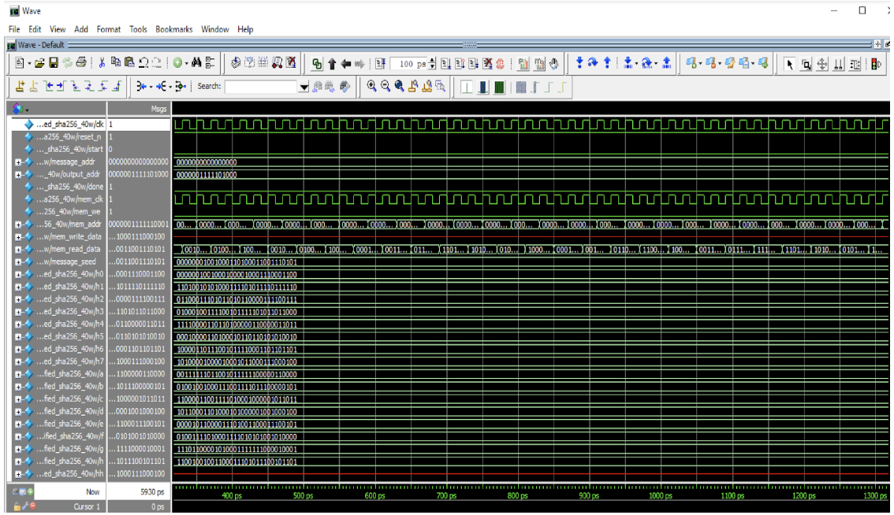
* __Testbench Results__
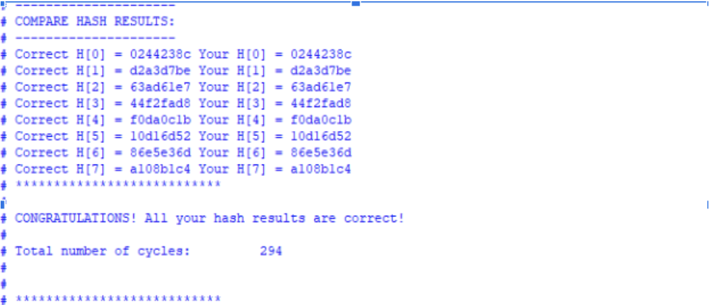
### RESOURCE UTILISATION
* __Regiters/ ALUT’s__
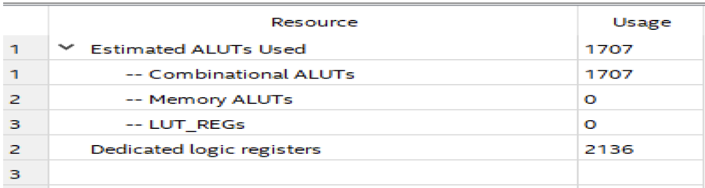
* __Flow Summary__
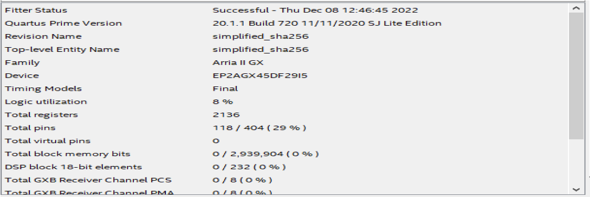
* __FMax__
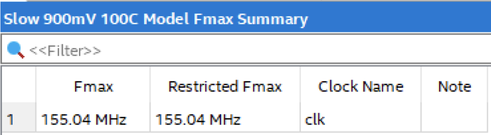

## PART 2: BITCOIN HASH 
### BITCOIN HASH  explained: 
Bitcoin hashing utilises the _one-to-one_ and _deterministic properties_ of the SHA256 algorithm to connect blocks in a block chain. This Bitcoin hash algorithm connects one block of information the the next through the hashes produced from the block information. That is, the hash value of the previous block is used to calculate the unique hash of the present block and so on. Since the hashes are __preimage__ and __collision resistant__, the chains that are produced are unique and secure.

### BITCOIN HASH implementation:
My bitcoin hash uses **sequential logic** through only one **always_ff block** and FSM logic. The FSM states are as follows: _IDLE, READ_BUFFER1, READ_MSG, BLOCK, COMPUTE, WRITE_BUFFER, WRITE_BUFFER2, WRITE_. For **parallelism**, I initialized 17 instances of **simplified_sha256.sv**: 1 for phase 1 and the rest for phase 2 and 3. I initialized all the relevant variables in the IDLE state, and then moved on to READ the message, with the help of a READ_BUFFER. We pad the message appropriately up to 32 bits. For PHASE_1, we prepare our weights array w0[] consists of the 16 word input as they are. We then allow Inst0 of sha256 to calculate the hashes h0[8] for the w0 input. Once done, in preparation for phase2 We prepare 16 new weight arrays w0[16] to w15[16] and pad them appropriately including nonces 0 to 15.
We then allow the 15 instances of sha256 to calculate the new hashes h1[8] to h16[8] using the hash h0 from phase 1. Once done calculating, we move on to PHASE_3. We prepare our weight arrays w0 to w15 with the new hashes from phase 2 and pad the remaining. In phase 3, we allow the sha256 instances to once again calculate the new hashes using the previous hashes. Once done, we have our final output in the form of h1[0] to h16[0]. We proceed to WRITE them into memory using 2 WRITE_BUFFERS. 

### WAVEFORM AND DELIVERABLES
* __Waveform__
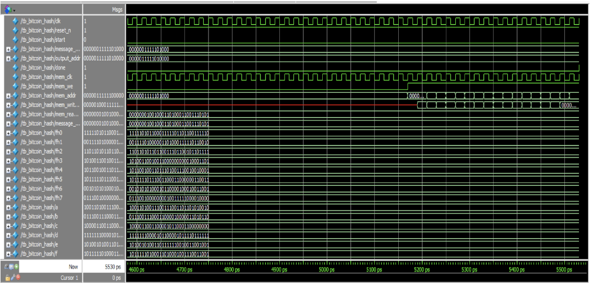

* __Testbench Results__
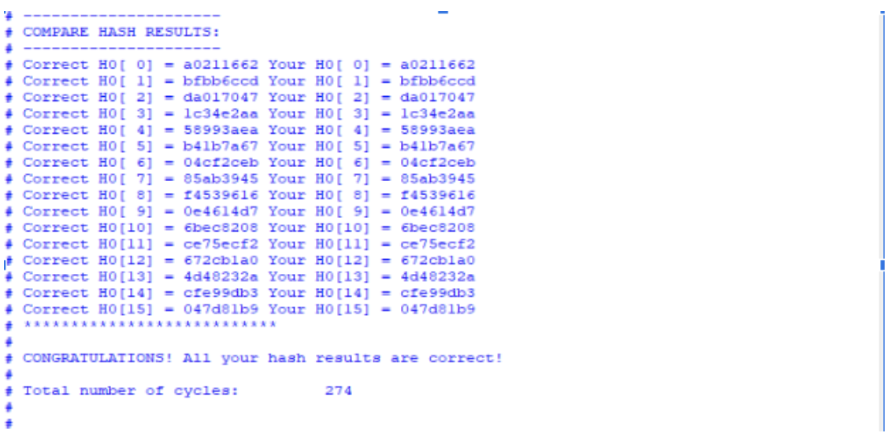
### RESOURCE UTILISATION
* __Regiters/ ALUT’s__
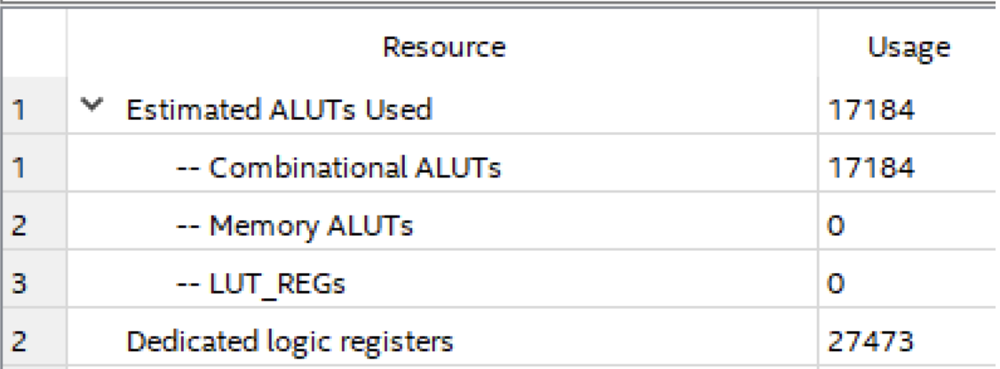
* __Flow Summary__
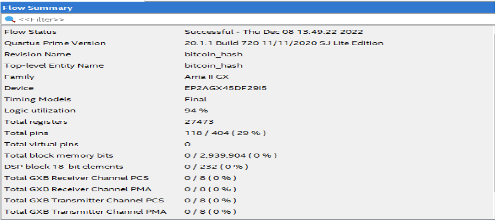
* __FMax__
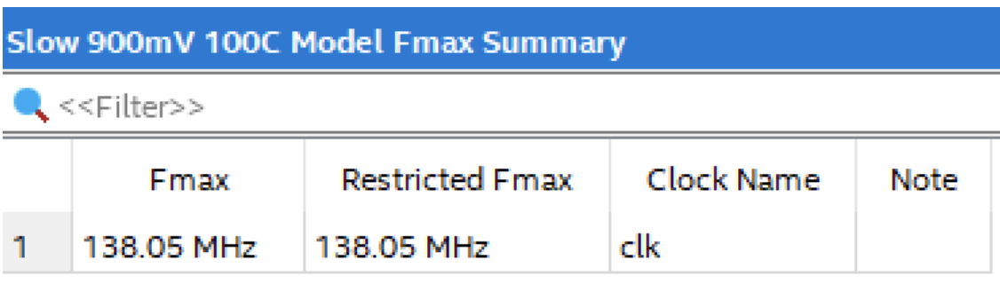

# SUMMARY

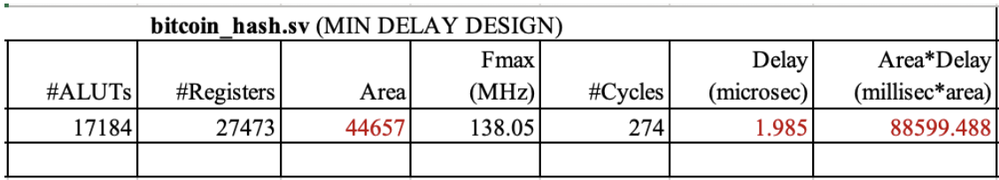

